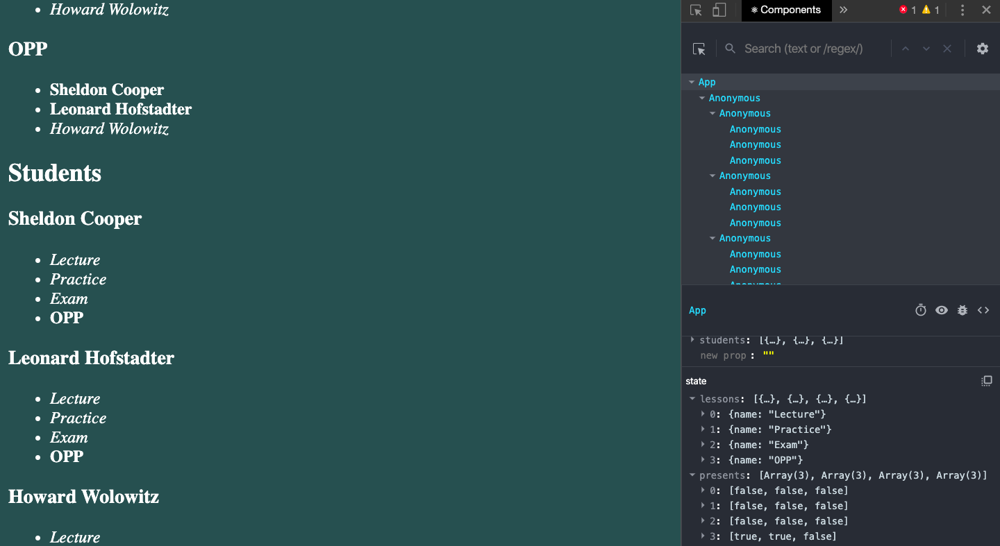

# KotlinJS 2.3
---
Пример приложения
-----------------------------------
### 1. Начальное состояние компонента App 

### 2. Компонент AddLesson

### 3. Состояние компонента App после нажатия на кнопку в компоненте AddLesson 

### 4. Состояние компонента App после нажатия на студента и занятие
